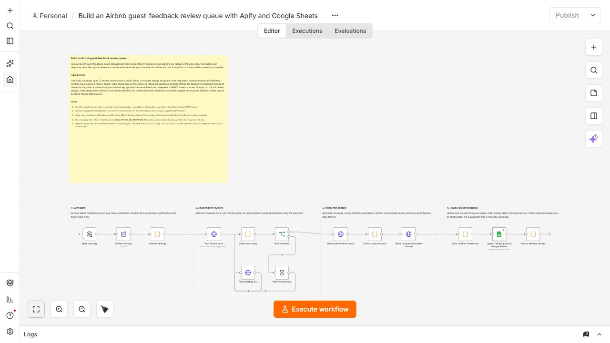

# Airbnb guest-feedback review queue in Google Sheets

Help hosts and property managers review a recent window of public guest feedback. Explicit rating and host-response rules identify reviews to inspect without AI or automatic replies.

[Actor](https://apify.com/luminar/airbnb-reviews-scraper-private-v1) · [Workflow JSON](./workflow.json) · [Header CSV](./sheet-header.csv)

## Setup

1. Import `workflow.json` into an empty n8n workflow. Built-in nodes only; inactive by default.
2. Create a Header Auth credential: name `Authorization`, value `Bearer YOUR_APIFY_TOKEN`. Select it on all four HTTP nodes. Keep tokens in credentials, outside JSON.
3. Connect Google Sheets OAuth2 on **Upsert review queue in Google Sheets**.
4. Create an `Airbnb Feedback` tab. Import `sheet-header.csv` into row 1. Preserve all 15 names and use only `upsertKey` for matching.
5. Set your spreadsheet ID and one public Airbnb listing URL in **Review settings**. The example property is a public demonstration, not our property.
6. Run manually. Filter `reviewPriority` and read the original review before responding on Airbnb. Repeat sequentially without overlapping runs.

## Priority and coverage

- `LOW_RATING_NO_RESPONSE`: observed rating below 4 and no public response text.
- `NO_RESPONSE_OBSERVED`: rating at least 4 and no public response text.
- `CHECK_RATING`: source rating missing or outside the supported range.
- `RESPONSE_PRESENT`: a public response was observed, regardless of rating.

These are review aids, not sentiment analysis or a guarantee that a response is required. The workflow never posts a reply. Reviewer profile fields are disabled. Only review content, rating, language, dates and public host response are retained.

Up to 25 recent reviews are checked. `CAPPED` means a bounded sample, not complete history. Older rows remain with their last observation timestamp. A review missing from the next window is not assumed deleted. A stable listing-and-review key updates existing rows, including changes to public host responses. Different listings have separate keys. No Telegram notification is included.

## Costs and failures

The template is free; Apify usage is paid through your account, including repeat delivery of unchanged reviews. See the Actor's current pricing. The default `$0.15` Actor charge cap is a maximum, not a price quote. `estimatedActorChargeUsd` reconciles the accepted event counts and run-specific prices; it is not an invoice or infrastructure-cost measurement.

The workflow starts one paid Actor run without automatic retries. Polling reads that same run. Source failures, untrusted coverage or inconsistent billing stop before Sheets. If the start request returns a network error, check recent Apify runs and their input before starting again. A run may already exist. Preserve the dataset and retry only failed destination delivery from verified rows; do not start another Actor to fix a Sheet write.

## Validation

Tested on local n8n Community Edition 2.37.10 with Actor build `rel-airbnb-reviews-20260901c`. Two full credentialed executions delivered exactly 25 rows, with the same stable keys and zero row growth on repeat. All 15 columns were read back and compared. Workflow times were 10.24 and 24.219 seconds; Actor times were 6.133 and 20.124 seconds. The estimated Actor charge was $0.07605 per test. These are owner QA results, not performance guarantees or customer activity.
