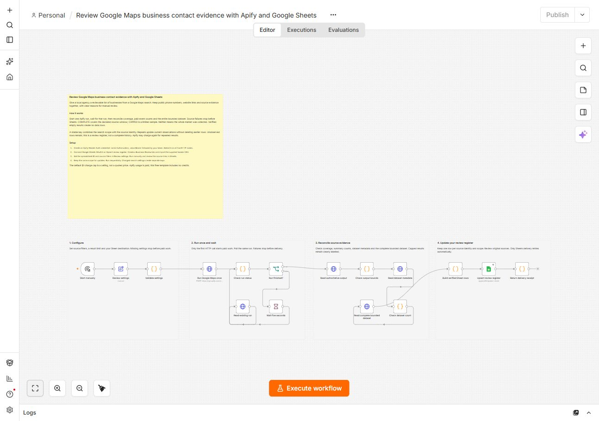

# Review Google Maps business contact evidence with Apify and Google Sheets

Give a local agency a reviewable list of businesses from a Google Maps search. Keep public phone numbers, website links and source evidence together, with clear reasons for manual review.

[Actor](https://apify.com/luminar/google-maps-contact-website-opportunity-leads) · [Workflow JSON](./workflow.json) · [Header CSV](./sheet-header.csv)

## Setup

1. Import workflow.json into an empty n8n workflow. Keep it inactive until configured.
2. Create an Apify Header Auth credential with header name Authorization and value Bearer followed by your own token. Select it on all five HTTP Request nodes. Never put the token in the JSON.
3. Connect Google Sheets OAuth2 to Upsert review register.
4. Create a spreadsheet with a **Business Review** tab. Import sheet-header.csv into row 1 exactly. Preserve every header; only upsertKey is a matching column.
5. Enter the spreadsheet ID in Review settings. Change the search, location and country. Up to 20 businesses are supported. The maximum is an upper limit, not a guaranteed result count.
6. Run manually and review the source links. Repeat sequentially with the same settings to update current observations.

## Reading the register

Listing contact evidence and website fetch results remain separate. An uncertain or failed website check becomes MANUALLY_VERIFY_WEBSITE, never proof that a business needs a new site. NO_SUPPORTED_WEBSITE_PITCH means the source does not support that offer. Public phone availability does not establish permission to contact someone.

Each key combines the selected source scope with a canonical source identity. Changed source filters create separate keys. A larger result limit retains the same keys. Rows not observed on a later run remain as their earlier observation: check observedAt and runUrl. No row is automatically deleted and no notification or outbound message is sent.

COMPLETE means the Actor completed the declared source window, not that it collected every result available on the service. CAPPED is an explicitly limited sample. The result cap is never a promised minimum. PARTIAL, BLOCKED, failed runs, identity mismatches and dataset-count drift stop before Sheets. Verified empty results produce no data rows.

## Cost and recovery

Use your own Apify account. The template includes no credits. The default $1 charge cap is a ceiling, not a run price. estimatedActorChargeUsd is calculated from the run's effective event prices and authoritative, non-simulated Actor charge receipts (plus any native platform-start charge); it is not a platform infrastructure-cost measurement or invoice. Repeated source results can be charged again.

Only Sheets delivery retries automatically. If a paid start returns a network or HTTP error, inspect recent runs and their input in Apify before attempting another start; a run may already exist. If Sheets alone fails, preserve the verified rows and retry destination delivery without starting another Actor. The workflow bounds polling to six minutes and execution to eight minutes.

## Validation

Tested on local n8n Community Edition 2.37.10 with pinned Actor build gmaps-contact-leads-20260901a. Two successful credentialed executions wrote 2 unique rows and retained 2 on repeat. All 19 columns were read back and compared, with zero duplicate keys. Coverage was COMPLETE and COMPLETE. These are owner QA results, not customer adoption or performance guarantees.

The repeat proof used the exposed settings for "Powell's City of Books", Portland, OR, USA, with a maximum of 10; it returned two businesses each time. The public default remains a restaurant search in New York. That broader search was also tested: successive samples added legitimate new businesses, and the register retained 10, then 13, then 14 unique rows. A changing search result set can grow the register without creating duplicate keys.
