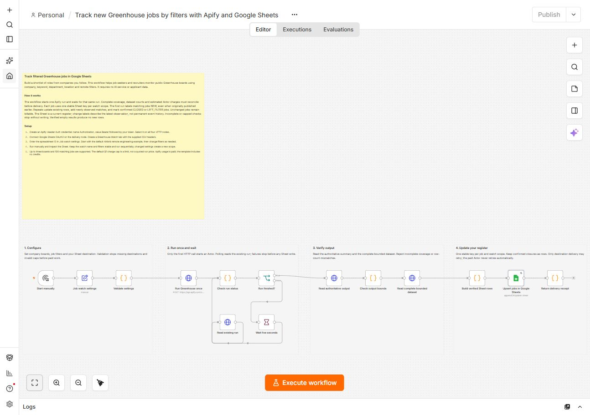

# Track new Greenhouse jobs in Google Sheets

Follow public job boards from companies you care about. Filter roles by keyword, department, location and remote mentions; maintain one current row per job and watch scope.

[Open the Actor](https://apify.com/luminar/greenhouse-jobs-change-monitor) · [Download workflow JSON](./workflow.json) · [Sheet header CSV](./sheet-header.csv)

## Setup

1. Import `workflow.json` into an empty n8n workflow. It uses built-in nodes and is inactive by default.
2. Create a Header Auth credential: header name `Authorization`, value `Bearer YOUR_APIFY_TOKEN`. Select this credential on all four HTTP Request nodes. Never paste the token into the workflow JSON.
3. Connect Google Sheets OAuth2 on **Upsert jobs in Google Sheets**.
4. Create a spreadsheet and a `Greenhouse Watch` tab. Import `sheet-header.csv` into its first row. Preserve every column name; the only matching column is `upsertKey`.
5. Enter the spreadsheet ID in **Job watch settings**. Start with the included `airbnb`, keyword `engineer`, remote-only example. Use company slugs such as `airbnb`; prefix European boards with `eu:`, for example `eu:overstory`. Up to three distinct boards are supported.
6. Run manually, inspect the Sheet and repeat sequentially. A Schedule Trigger can be added later; do not run overlapping checks of the same scope.

Keywords are comma-separated alternatives searched in titles and content. Department and location are case-insensitive substrings. Remote-only checks a source location mention; it does not establish worldwide eligibility. The workflow bounds matching jobs at 100 and source jobs per board at 1,000. Narrow filters if coverage is capped. A changed watch name or filter set creates a separate scope and separate rows.

## What changes mean

- `NEW`: newly observed by this watch, including existing posts on the first run.
- `UPDATED`: the Actor detected a change to the source job.
- `UNCHANGED`: the verified job is still present without a detected change.
- `CLOSED`: absent from a completely checked board.
- `LEFT_FILTER`: still on the board but no longer matches this watch.

The Sheet is a current register, not an event history. Later observations replace change labels. Closure rows remain in the Sheet; rows are never automatically deleted. Verified empty results without prior jobs produce no new rows. No Telegram, email or AI service is required or included.

## Cost and error recovery

The free template uses your own Apify and Google credentials. Apify charges for a successful check and verified job/absence results, including unchanged jobs; calculated changes are included. See the Actor's current pricing. The default `$1` cap is a maximum, not the price of a run. `estimatedActorChargeUsd` reconciles source output with the run's effective event prices and is not an invoice or a measurement of platform infrastructure cost.

The workflow starts one paid run without automatic retry. It polls only that run and writes only after complete coverage and reconciled counts. Only Sheets delivery retries. If the initial POST returns a network/502 error, check recent runs and their INPUT in Apify before starting again: a run may already have succeeded. Preserve that run's dataset. Retry destination delivery with its verified rows when necessary; do not launch another paid run merely to repeat a failed Sheet write.

## Validation

Tested using local n8n Community Edition 2.37.10 and immutable Actor build `greenhouse-release-20260906f`. Two successful complete executions wrote 22 matching jobs and retained exactly 22 unique Sheet rows on repeat. All 15 columns were read back and compared; zero duplicate keys. Workflow durations were 12.135 and 8.208 seconds; Actor durations 5.525 and 3.373 seconds. These are owner QA results, not customer adoption or performance guarantees.
