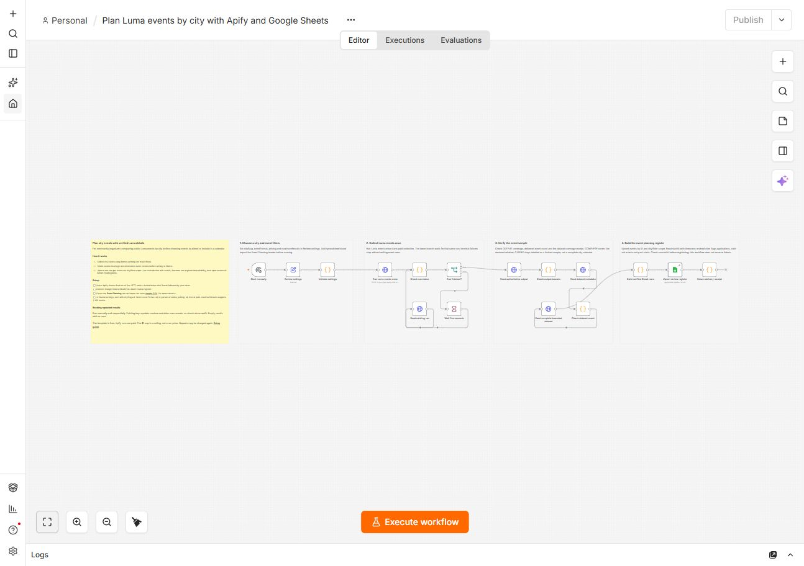

# Plan Luma events by city with Apify and Google Sheets

Give a community organizer an event-planning register for one city. Bring public Luma dates, timezones, venue information and registration requirements into Google Sheets without copying attendee profiles or sending invitations.

[Actor](https://apify.com/luminar/luma-events-scraper-monitor) · [Workflow JSON](./workflow.json) · [Header CSV](./sheet-header.csv)

## Setup

1. Import workflow.json into an empty n8n workflow. Keep it inactive until configured.
2. Create an Apify Header Auth credential with header name Authorization and value Bearer followed by your own token. Select it on all five HTTP Request nodes. Never put the token in the JSON.
3. Connect Google Sheets OAuth2 to Upsert review register.
4. Create a spreadsheet with an **Event Planning** tab. Import sheet-header.csv into row 1 exactly. Preserve every header; only upsertKey is a matching column.
5. Enter the spreadsheet ID in Review settings. Start with sf, then use another supported Luma city slug. Choose all, in_person or online events and all, free or paid pricing. Up to 100 events are supported.
6. Run manually and review the source links. Repeat sequentially with the same settings to update current observations.

## Reading the register

Keep UTC timestamps and the source timezone together. The review action highlights applications, sold-out events and dates that have already started. Empty price or availability fields remain unknown. Review the event page before making plans; the workflow does not register guests or book tickets.

Each key combines the selected source scope with a canonical source identity. Changed source filters create separate keys. A larger result limit retains the same keys. Rows not observed on a later run remain as their earlier observation: check observedAt and runUrl. No row is automatically deleted and no notification or outbound message is sent.

COMPLETE means the Actor completed the declared source window, not that it collected every result available on the service. CAPPED is an explicitly limited sample. The result cap is never a promised minimum. PARTIAL, BLOCKED, failed runs, identity mismatches and dataset-count drift stop before Sheets. Verified empty results produce no data rows.

## Cost and recovery

Use your own Apify account. The template includes no credits. The default $1 charge cap is a ceiling, not a run price. estimatedActorChargeUsd is calculated from the run's effective event prices and authoritative, non-simulated Actor charge receipts (plus any native platform-start charge); it is not a platform infrastructure-cost measurement or invoice. Repeated source results can be charged again.

Only Sheets delivery retries automatically. If a paid start returns a network or HTTP error, inspect recent runs and their input in Apify before attempting another start; a run may already exist. If Sheets alone fails, preserve the verified rows and retry destination delivery without starting another Actor. The workflow bounds polling to six minutes and execution to eight minutes.

## Validation

Tested on local n8n Community Edition 2.37.10 with pinned Actor build release-20260903d. Two successful credentialed executions wrote 25 unique rows and retained 25 on repeat. All 20 columns were read back and compared, with zero duplicate keys. Coverage was CAPPED and CAPPED. These are owner QA results, not customer adoption or performance guarantees.

Revision R1 (8 September 2026): the yellow overview explains setup and the four white sections explain this workflow’s data checks and delivery. The exact revised JSON passed two new credentialed executions and visual inspection in the n8n editor.
