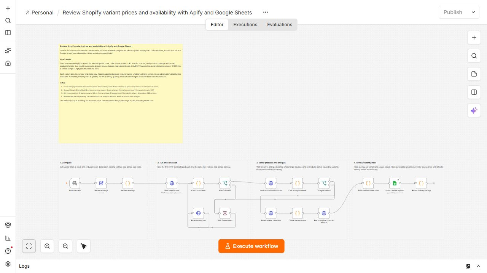

# Review Shopify variant prices and availability with Apify and Google Sheets

Keep a variant-level price and availability register for a known public Shopify store, collection or product URL. Compare sizes, formats and SKUs with observation dates and source links.

[Actor](https://apify.com/luminar/shopify-products-price-stock-monitor) · [Workflow JSON](./workflow.json) · [Header CSV](./sheet-header.csv)

## Setup

1. Import workflow.json into an empty n8n canvas. Keep it inactive until configured.
2. Create an Apify Header Auth credential: header name Authorization, value Bearer followed by your own token. Select it on all five HTTP Request nodes. Never put a token in the workflow JSON.
3. Connect Google Sheets OAuth2 on Upsert review register.
4. Create a spreadsheet with a **Variant Review** tab. Import sheet-header.csv into row 1 exactly. Keep all 24 columns; only upsertKey is a matching column.
5. Enter the spreadsheet ID, one clean HTTPS source URL and a product limit in Review settings. Supported sources are a public Shopify store root, collection or product URL, optionally with a language prefix. Remove tracking query parameters. No Shopify merchant credential is needed.
6. Run manually. Filter available or reviewAction to examine unavailable variants. Compare prices only within the same currency and review product links before a business decision.
7. Repeat sequentially with the same URL to update existing variants. A larger product cap retains the same keys.

The default targets one public coffee product with multiple sizes and formats. It is an example, not an endorsement or a promise that its variants remain unchanged.

## Reading the register

Each row identifies one product variant. productVariantCount is the source product's variant total; productsThisRun is the number of billed products; variantsThisRun is the number of delivered Sheet rows. estimatedActorChargeUsd is a run-level amount repeated on every row: do not sum this column across variants.

Availability means public buyability, not stock quantity, warehouse inventory or sales volume. A blank compareAtPrice means unavailable evidence, not zero. Listed prices exclude assumptions about shipping, taxes, discounts and checkout eligibility. Review the product page for those details.

The key combines the exact source URL, product identity and variant ID. Different URLs create separate scopes, even if they include the same product. Unobserved older rows remain; inspect observedAt and runUrl. The workflow does not compute price changes, maintain a full history, infer removals or write to Shopify.

COMPLETE means the declared source window finished. CAPPED is a visibly limited sample. Choose at most 10 products; a maximum is never a guaranteed minimum. The workflow rejects more than 500 variants rather than truncating them. Narrow the source URL or lower the product cap if this bound is exceeded. PARTIAL/FAILED coverage, mismatched identities, incomplete variants and dataset-count drift stop before Sheets. Verified empty snapshots add no rows.

## Cost and recovery

The template is free; your Apify usage is paid. The default $1 charge cap is a ceiling, not a quoted run price. Each verified catalog check and product is charged at the run's effective event prices. Variants are included in the product event. Repeated products may be charged again. estimatedActorChargeUsd uses the completed run's settled native event counts and effective prices; it is an event-charge estimate, not an invoice or infrastructure-cost measurement.

Only one HTTP node starts a run. Other HTTP nodes read its status, OUTPUT and dataset. Lagging native charge counters are polled on that same run. Polling has a six-minute budget; total workflow execution has eight minutes. Only Sheets delivery retries automatically.

If the paid start returns a network error, inspect recent Apify runs and their input before another start: a run may already exist. If only Sheets delivery fails, preserve the verified rows and retry destination delivery without starting another Actor. Keep runs sequential to avoid simultaneous writes.

## Validation

Tested on local n8n Community Edition 2.37.10 with pinned Actor build shopify-20260908m. Two successful credentialed executions wrote 8 unique rows and retained 8 on repeat. All 24 columns were read back and compared, with zero duplicate keys. Coverage was COMPLETE and COMPLETE. These are owner QA results, not customer adoption or performance guarantees.
