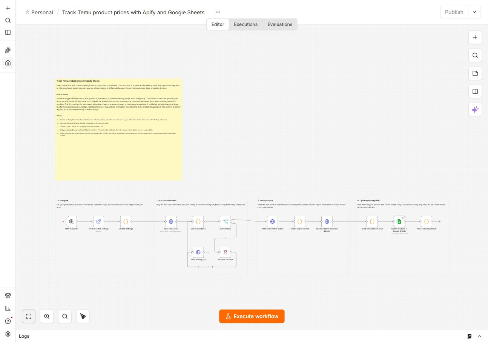

# Track Temu product prices with Apify and Google Sheets

Maintain a small watchlist of exact Temu products in Google Sheets. The workflow starts the [Luminar Temu Actor](https://apify.com/luminar/temu-product-scraper-price-monitor) once, checks its output, and updates the same row when you repeat the same watchlist.

## Import and configure

1. Download [workflow.json](workflow.json) and import it into a new, empty n8n workflow. It uses built-in nodes; no community-node installation is needed. It is manual and inactive by default.
2. Create an **HTTP Header Auth** credential. Header name: `Authorization`. Header value: `Bearer YOUR_APIFY_TOKEN`, replacing the example with your own token. Select this credential on all four HTTP Request nodes. Store the token in n8n credentials, never in the workflow JSON.
3. Connect your Google Sheets OAuth2 credential to **Upsert products in Google Sheets**. On self-hosted n8n, configure your Google OAuth client using the callback URL shown by n8n. Use Sheets and `drive.file` access for the destination file.
4. Create a spreadsheet with a tab named **Temu Watch**. Import [sheet-header.csv](sheet-header.csv) as its first row, keeping the column names unchanged. The connected Google account must be able to edit the file.
5. Open **Product watch settings**. Enter one to five exact Temu goods IDs, a supported market, your spreadsheet ID and a stable monitoring scope. Replace every setup placeholder. Start with one product and the default $0.10 maximum charge per run.
6. Execute manually and inspect your Sheet. Repeat sequentially with the same scope and watchlist to update existing rows. No schedule is enabled by this template.

## What is written

The sheet records product identity, source-reported price and availability, previous price, change fields, coverage, observation time and the Apify run URL. `estimatedActorChargeUsd` estimates accepted Actor events using the run's effective event prices; it is not an invoice total. Missing prices remain blank.

`upsertKey` combines stable monitoring scope, market, target list and product identity. Keep **Append or Update Row** matching only `upsertKey`. This is a current register, not a permanent price-history table. A different watchlist or scope creates different keys.

Incomplete or unverified results stop before writing. The paid Actor starts once; polling reads that existing run. A failed destination can be retried from preserved data without starting another paid run. The Actor is pinned to tag `temu-release-20260906d` (build `Hy2htFWnbJcwLiyHl`).

## Tested example

Two sequential, credentialed executions were tested on local n8n Community Edition **2.37.10**, on **6 September 2026**, using one product. Workflow durations were **11.233 seconds** and **29.213 seconds**; Actor durations were **4.828 seconds** and **23.907 seconds**. Both succeeded. The Sheet had **one row after each run**, zero duplicate keys, and all 16 output columns were checked against delivered values.

These are bounded owner tests, not customer activity or a performance guarantee. Runtime depends on input and source availability. Local n8n orchestrates the workflow; the Actor runs on Apify and Apify usage charges apply. The template includes no credits. No n8n Cloud purchase was needed for the local test.

The JSON is ready for direct import. Creator marketplace publication is a separate review process. [artifact-manifest.json](artifact-manifest.json) records the workflow and companion file hashes. No credentials or private Sheet destination are included.
