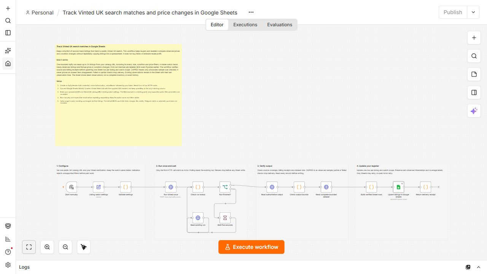

# Vinted UK sourcing watch in Google Sheets

Maintain a shortlist of public second-hand listings and compare observed prices and condition changes. Use your own filtered Vinted UK catalog URL. No AI service, automatic purchase or resale-profit estimate is involved.

[Actor](https://apify.com/luminar/vinted-listing-price-monitor) · [Workflow JSON](./workflow.json) · [Header CSV](./sheet-header.csv)

## Setup

1. Import `workflow.json` into an empty n8n workflow. Built-in nodes only; inactive by default.
2. Create Header Auth: name `Authorization`, value `Bearer YOUR_APIFY_TOKEN`. Select it on all four HTTP nodes. Keep tokens outside the JSON.
3. Connect Google Sheets OAuth2 on **Upsert listings in Google Sheets**.
4. Create a `Vinted Watch` tab and import `sheet-header.csv` into row 1. Preserve all 15 column names; match only `upsertKey`.
5. Enter the spreadsheet ID, a public `https://www.vinted.co.uk/catalog?...` URL and a stable watch name in **Listing watch settings**.
6. Run manually, inspect the observations and repeat sequentially. Do not overlap runs of the same watch.

Supported catalog parameters: `search_text`, `catalog_ids`, `brand_ids`, `size_ids`, `status_ids`, `color_ids`, `price_from`, `price_to`, `currency` and `order`. Array parameters with `[]` are normalized. Copy actual filter values from Vinted; remove tracking parameters. Vinted determines source search relevance and may return related products. Inspect titles, sizes, currency and prices before any purchasing decision.

## Reading the Sheet

Up to 24 listings and two catalog pages are observed. First-run matches are `NEW`, including older listings newly observed by the watch. Repeats may label `PRICE_DROP`, `PRICE_RISE`, `STATUS_CHANGED` or `UNCHANGED`. `GONE` requires complete comparable source coverage; capped samples never prove disappearance.

The Sheet stores latest observations, not complete inventory or permanent event history. Rows outside a later sample remain with their last observation timestamp. New listings legitimately increase row counts. Repeated deliveries of existing listings update their stable keys. Changing the watch name or filters creates a new scope and separate rows. No Telegram notifications are included.

## Costs and recovery

The template is free; Apify usage is paid using your own account. A verified source target and delivered listings are charged, including unchanged listings; computed changes are included. See the Actor's current pricing. The default `$0.10` Actor charge cap is a maximum, not the run price. `estimatedActorChargeUsd` reconciles accepted events with run-specific prices; it is not an invoice or infrastructure-cost measurement.

Source blocking or untrusted coverage stops before Sheets and preserves previous observations. Only Sheets delivery may retry automatically. If the start request returns a network error, inspect recent Apify runs and their input before another paid start. Preserve the dataset and retry only destination delivery from verified rows when needed.

## Validation

Tested on local n8n Community Edition 2.37.10 with build `vinted-release-20260906g`. The final repeat delivered 24 existing listings, updated all 15 output columns, added zero keys and produced zero duplicates. The QA Sheet contained 51 rows: 24 in this watch and 27 preserved from an earlier watch scope. Its row count stayed 51 on repeat. Earlier broader searches legitimately added new listings as their live result sets changed.

The final two workflow times were 82.985 and 17.001 seconds; Actor times were 72.913 and 12.209 seconds. Estimated Actor charges were $0.0404 per run. A prior source-blocked run correctly stopped before Sheets. These are owner QA observations, not reliability or performance guarantees. Source availability can vary; successful execution does not make a capped sample complete.
